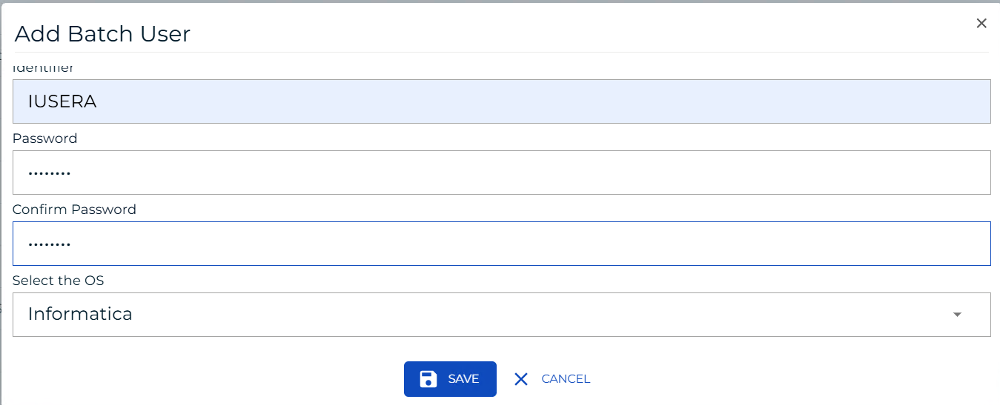
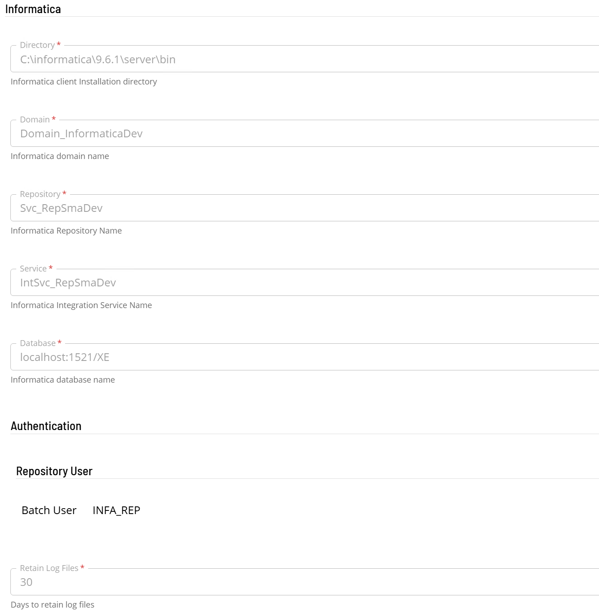
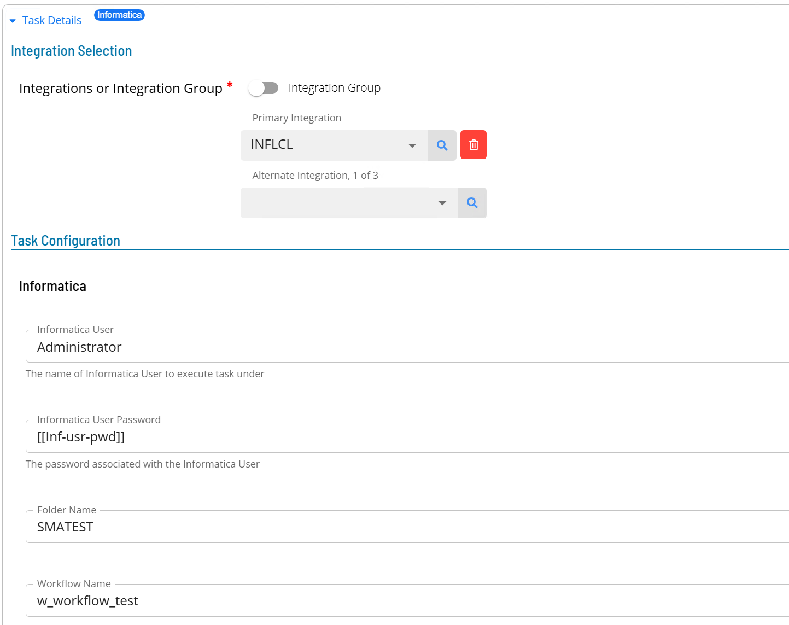
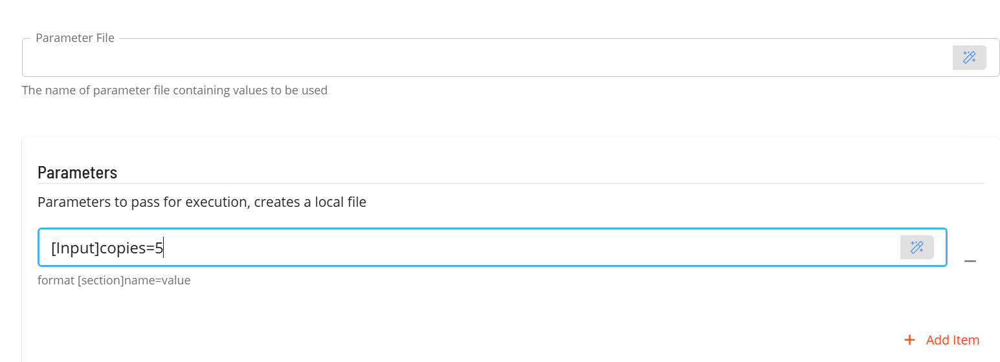

# Informatica Operation

Once the sma.acs.InformaticaOnPrem.dll plugin has been registered with the OpCon system, it will be possible to perform agent and task definitions.
All definitions can only be performed using Solution Manager.

## Defining Informatica Batch Users

The Informatica implementation requires an Informatica batch user to provide the user / password for connection to the Informatica database. It should be noted that the database user must have the required privileges to access the following tables:

folder names   : opb_subject     (select SUBJ_NAME from opd_subject)
workflow names : REP_WORKFLOWS   (select WORKFLOW_NAME from REP_WORKFLOWS where SUBJECT_AREA = 'folder name')

Before creating the the Informatica connection or tasks, ensure that an appropriate Batch User is created that will be used to access the repository (Oracle connection).  

1.  Open Solution Manager.
2.  From the Home page select **Library**
3.  From the ***Security*** Menu select **Batch Users**.
4.  Select **+Add** to add a new Batch User.
5.  Select **Informatica** from the ***Select the target OS*** drop-down list.
6.  Enter the User name that will be used to connect to the Informatica Database in the **Identifier** field.
7.  Enter the password of the User in the **Password** and **Confirm** fields.
8.  Select **Save**.

## Defining Informatica connection

The Agent definition is defined by adding a new Informatica Agent definition using Solution Manager.

Items defined in red are required values.

1.  Open Solution Manager.
2.  From the Home page select **Library**
3.  From the ***Administration*** Menu select **Agents**.
4.  Select **+Add** to add a new agent definition.
5.  Fill in the agent details
    - Insert a unique name for the connection.
    - Select **Informatica** from the **Type** drop-down list.
    - If the software is installed within a SmaRelay environment
      - Select **General Settings**
      - In the **NetCom Name** field enter the name of the SmaRelay environment.
    - Select **Informatica Settings**
    - In the **Directory** field enter the full path of the directory where the Informatica client binaries are installed.
    - In the **Domain** field enter the domain name of the associated Informatica installation.
    - In the **Repository** field enter the repository name of the associated Informatica installation.
    - In the **Service** field enter the name of the associated Information Service Instance.  
    - In the **Database** field enter the address, the port number and the database name of the associated Information database (***address:port/database***).  
    - In the **Authentication** section
      select a Batch User from the drop-down list. 
    - In the **Retain Log Files** field enter the number of days to retain Informatica ACS log files (default 30 days).  
6.  Save the definition changes. 
7.  Now select **Communication Settings**
    Ensure that the **Requires XML Escape Sequences: User-Defined** field is set to **True**. 
    If not change the field and save the definition changes.
8.  Start the connection by selecting the **Change Communication Status** button and selecting **Enable Full Comm.**. 

## Defining tasks

The Informatica Onprem Connection supports the following task types:

TaskType             | Description
---------------------|------------
RUN                  | Create a workflow task. 

During task creation, a list of available folders will be retrieved from the Informatica database and added to the **Folder Name** drop-down list.
Once a folder name has been selected from the drop-down list, a list of available workflows within the folder will be retrieved from the Informatica database and added to the **Workflow Name** drop down list.

1.  Open Solution Manager.
2.  From the Home page select **Library**
3.  From the ***Administration*** Menu select **Master Jobs**.
4.  Select **+Add** to add a new master job definition.
5.  Fill in the task details.
    - Select the **Schedule** name from the drop-down list.
    - In the **Name** field enter a unique name for the task within the schedule.
    - Select **Informatica** from the **Job Type** drop-down list.
    - Select **Run** from the **Task Type** drop-down list.
    
Enter details for Task Type **Run**. 

1.  Select the **Task Details** button.
2.  In the **Integration Selection** section, select the primary integration which is an ACSInformatica connection previously defined.
3.  In the **Task Configuration** section, enter the required task fields
    - In the **Informatica User** field enter the user name that will be used to start the task on the Informatica environment.
    - In the **Informatica User Password** field enter the password of the user. It is suggested that an encrypted global property is used to contain the password value.
    - From the **Folder Name** drop-down list select the folder where the workflow is defined. Once a folder is selected, a list of available workflows will be added to the **Workflow Name** drop-down list.
    - From the **Workflow Name** drop-down list, select the required workflow name.
4.  Save the definition changes.  

## Working with Parameters
There are two types of possibilities when working with parameters. It is possible to use a parameter file defined on the Informatica system, or it is possible to create a local parameter file and pass these values when processing the request.

1. In the **Parameter** File field enter the full name of parameter file on the Informatica system to be used by the task.
2. In the **Parameters** section, add parameters that will be included in a generated local parameter file which will be used by the task.
   - Select the **+Add Item** button and enter the parameter value. The value has the following format ***[section]name=value***
     where Section is the name of the header in the parameter file
           name is the name of the parameter
           value is the value of the parameter

 
