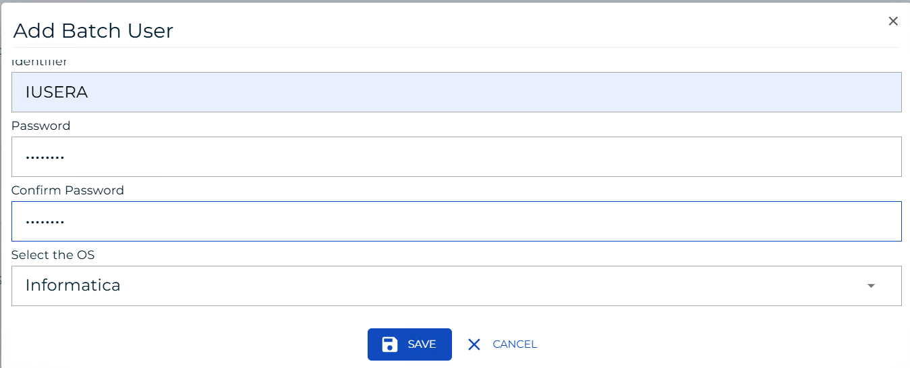
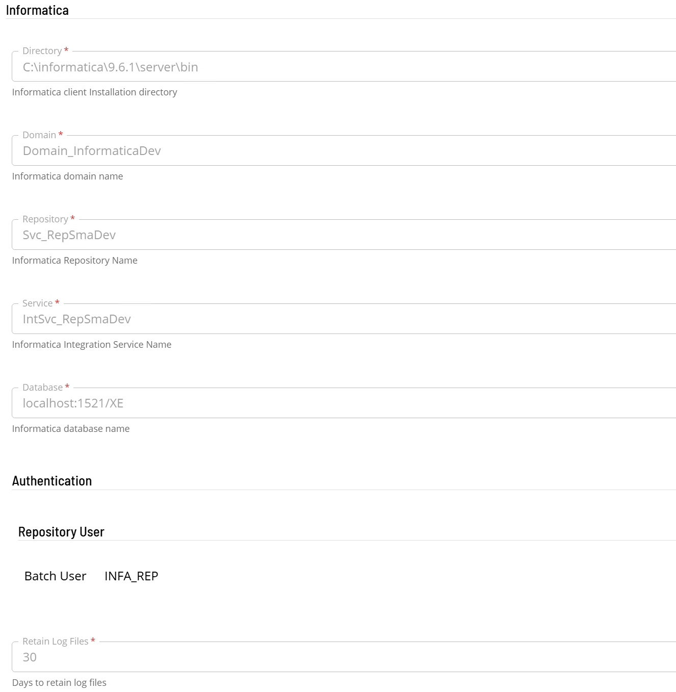
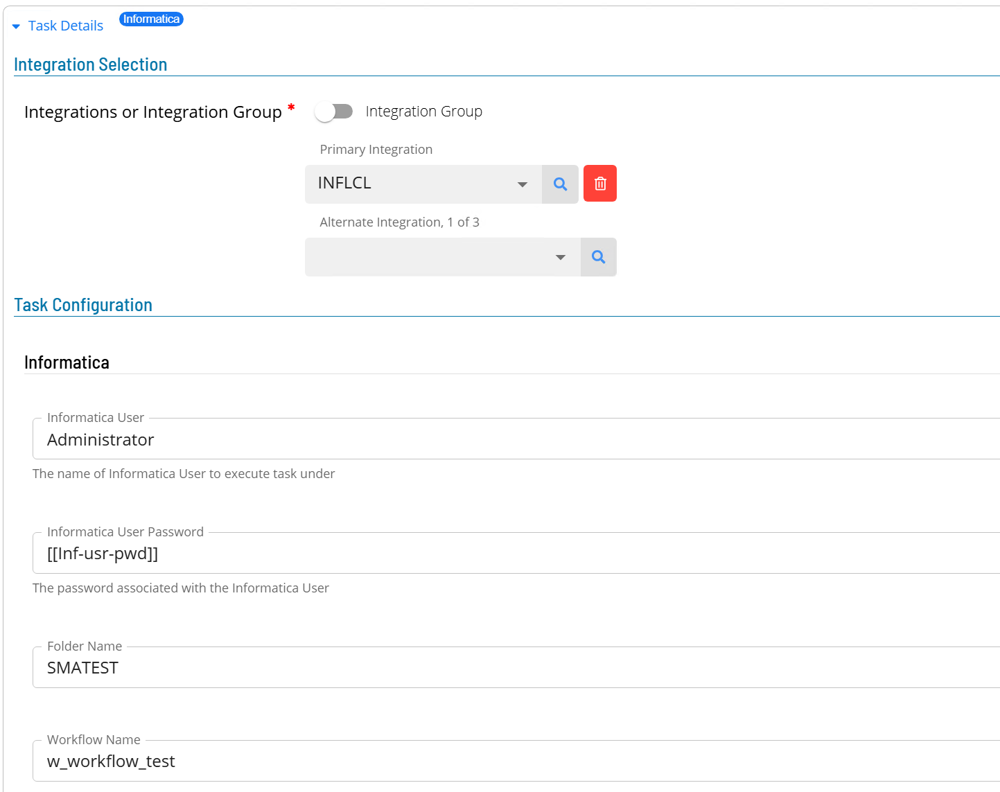
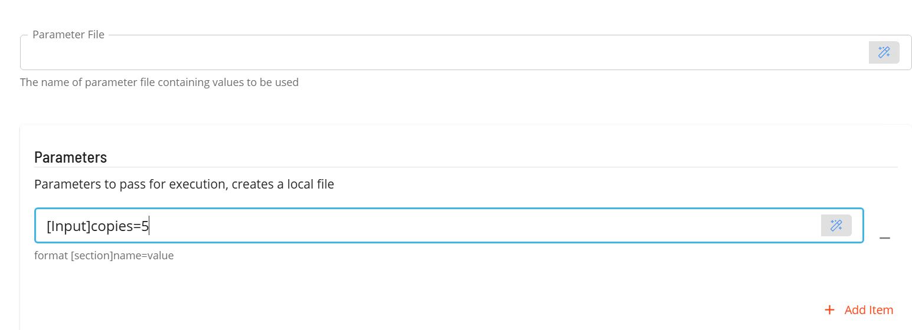

# Informatica Operation

**Theme:** Configure | **Audience:** Automation Engineer

## What is it?

Once the Informatica On-Prem ACS connector has been registered with the OpCon system, it is possible to perform agent and job definitions. All definitions can only be performed using Solution Manager.

- Use this when defining a new Informatica connection in OpCon to enable workflow submission and monitoring.
- Use this when creating batch user credentials to provide secure repository access without embedding credentials in job definitions.
- Use this when configuring run tasks that reference specific folders and workflows in the Informatica environment.

## Defining Informatica batch users

The Informatica implementation requires an Informatica batch user to provide the user name and password for connection to the Informatica database. The database user must have the required privileges to access the following tables:

- Folder names: `opb_subject` — `select SUBJ_NAME from opb_subject`
- Workflow names: `REP_WORKFLOWS` — `select WORKFLOW_NAME from REP_WORKFLOWS where SUBJECT_AREA = 'folder name'`

Before creating the Informatica connection or tasks, ensure that an appropriate batch user is created to access the repository (Oracle connection).

To define an Informatica batch user, complete the following steps:

1. Open Solution Manager.
2. From the Home page, select **Library**.
3. From the **Security** menu, select **Batch Users**.
4. Select **+Add** to add a new batch user.
5. Select **Informatica** from the **Select the target OS** list.
6. In the **Identifier** field, enter the user name used to connect to the Informatica database.
7. In the **Password** and **Confirm** fields, enter the password of the user.
8. Select **Save**. The batch user is saved.

## Defining an Informatica connection

Add a new Informatica agent definition using Solution Manager. Items marked in red are required values.

To define an Informatica connection, complete the following steps:

1. Open Solution Manager.
2. From the Home page, select **Library**.
3. From the **Administration** menu, select **Agents**.
4. Select **+Add** to add a new agent definition.
5. Enter the agent details:
   a. Enter a unique name for the connection.
   b. Select **Informatica** from the **Type** list.
   c. If the software is installed within a SmaRelay environment:
      - Select **General Settings**.
      - In the **NetCom Name** field, enter the name of the SmaRelay environment.
   d. Select **Informatica Settings**.
   e. In the **Directory** field, enter the full path of the directory where the Informatica client binaries are installed. The connector runs `pmcmd.exe` from this directory.
   f. In the **Domain** field, enter the domain name of the associated Informatica installation.
   g. In the **Repository** field, enter the repository name of the associated Informatica installation.
   h. In the **Service** field, enter the name of the associated Informatica Service Instance.
   i. In the **Database** field, enter the Oracle data source of the Informatica repository database, as address, port number, and database name (`address:port/database`, for example `host:1521/service`). The folder and workflow lists are read from this database.
   j. In the **Authentication** section, select a batch user from the list.
   k. In the **Retain Log Files** field, enter the number of days to retain Informatica ACS log files (default: 30 days).
6. Select **Save** to save the definition changes.
7. Select **Communication Settings**. Verify that the **Requires XML Escape Sequences: User-Defined** field is set to **True**. If not, update the field and select **Save**.
8. Select the **Change Communication Status** button and select **Enable Full Comm.** to start the connection. The agent comes online.

## Defining tasks

The Informatica On-Prem connection supports the following task types:

| Task type | Description |
|-----------|-------------|
| RUN | Create a workflow task. |

During task creation, a list of available folders is retrieved from the Informatica database and added to the **Folder Name** list. Once a folder name is selected from the list, a list of available workflows within the folder is retrieved from the Informatica database and added to the **Workflow Name** list.

To define an Informatica task, complete the following steps:

1. Open Solution Manager.
2. From the Home page, select **Library**.
3. From the **Administration** menu, select **Master Jobs**.
4. Select **+Add** to add a new master job definition.
5. Enter the task details:
   a. Select the schedule name from the **Schedule** list.
   b. In the **Name** field, enter a unique name for the task within the schedule.
   c. Select **Informatica** from the **Job Type** list.
   d. Select **Run** from the **Task Type** list.

To enter details for the **Run** task type, complete the following steps:

1. Select the **Task Details** button.
2. In the **Integration Selection** section, select the primary integration, which is an ACSInformatica connection previously defined.
3. In the **Task Configuration** section, enter the required task fields:
   a. In the **Informatica User** field, enter the user name used to start the task on the Informatica environment.
   b. In the **Informatica User Password** field, enter the password of the user. It is suggested that an encrypted global property is used to contain the password value, so the password is not stored in the job definition.

      :::caution
      The job log records the command the connector runs for each workflow call, including the Informatica user's password. Restrict who can view this job's output, and use an Informatica account limited to the workflows it needs to run.
      :::

   c. From the **Folder Name** list, select the folder where the workflow is defined. Once a folder is selected, a list of available workflows is added to the **Workflow Name** list.
   d. From the **Workflow Name** list, select the required workflow name.
4. Select **Save** to save the definition changes. The task is saved.

## Working with parameters

There are two alternative ways to supply parameters: a **Parameter File** defined on the Informatica system, or **Parameters** entries that the connector writes to a local parameter file and passes when processing the request. Use one or the other.

:::note
If **Parameter File** has a value, the **Parameters** entries are not used.
:::

To use a parameter file on the Informatica system, in the **Parameter File** field, enter the full name of the parameter file to be used by the task.

To use local parameters instead, leave **Parameter File** empty and complete the following steps:

1. In the **Parameters** section, select the **+Add Item** button.
2. Enter the parameter value using the following format: `[section]name=value`
   - `section` is the name of the header in the parameter file
   - `name` is the name of the parameter
   - `value` is the value of the parameter

## Job status

The connector checks the workflow's status in Informatica while the job runs:

- While Informatica reports **Running**, the job keeps running.
- When Informatica reports **Succeeded**, the job finishes successfully.
- Any other status fails the job.
- When you kill the job, the connector sends `stopworkflow`. The job shows as killed if the workflow stops, and fails if the stop request fails.

The job log contains the folder, workflow and parameters, the commands the connector ran, and the output of pmcmd.

## Configuration options

### Connection settings

| Setting | What It Does | Default | Notes |
|---------|-------------|---------|-------|
| Name | Unique identifier for the connection in OpCon | None | Required |
| NetCom Name | Name of the SmaRelay environment | None | Required only for SmaRelay installations |
| Directory | Full path to the Informatica client binaries directory, which contains `pmcmd.exe` | None | Required |
| Domain | Informatica domain name | None | Required |
| Repository | Informatica repository name | None | Required |
| Service | Informatica Service Instance name | None | Required |
| Database | Oracle data source of the Informatica repository database, used for the folder and workflow lists | None | Required. Format: `address:port/database` |
| Authentication (Batch User) | Oracle database credentials used for repository access | None | Batch user must be defined before creating the connection |
| Retain Log Files | Number of days to retain Informatica ACS log files | 30 | |
| Requires XML Escape Sequences | Enables XML escape sequence handling for the connection | False | Must be set to **True** |

### Task settings

| Setting | What It Does | Default | Notes |
|---------|-------------|---------|-------|
| Informatica User | User name used to start the workflow on the Informatica environment | None | Required |
| Informatica User Password | Password for the Informatica user | None | Use an encrypted global property. The job log records the password; see [Security considerations](#security-considerations) |
| Folder Name | Folder on the Informatica system that contains the target workflow | None | Retrieved from the Informatica database; required |
| Workflow Name | Workflow to run | None | Retrieved after a folder is selected; required |
| Parameter File | Full path to a parameter file on the Informatica system | None | Optional. When set, **Parameters** entries are not used |
| Parameters | Local parameter values passed to the workflow at run time | None | Format: `[section]name=value`; optional. Used only when **Parameter File** is empty |

## Security considerations

**Authentication:** Two sets of credentials are required. A batch user (Oracle database credentials) authenticates against the Informatica repository to retrieve folder and workflow metadata. A separate Informatica user account authenticates to the Informatica environment to run workflows.

**Authorization:** The Oracle batch user must have `SELECT` privileges on the `opb_subject` and `REP_WORKFLOWS` tables. The Informatica user must have privileges to run the defined workflows in the Informatica environment.

**Data security:** Batch user credentials are stored as OpCon batch user definitions and are not exposed in job or agent configurations.

**Sensitive data:** The Informatica User Password is used at job run time. Store this value as an encrypted global property rather than entering a plaintext password in the task definition.

:::caution
The job log records the command the connector runs for each workflow call, including the Informatica user's password. Restrict who can view this job's output, and use an Informatica account limited to the workflows it needs to run.
:::

## FAQs

**Why is the Folder Name list empty when defining a task?**
The folder list is retrieved from the Informatica database at task creation time. If the list is empty, verify that the Informatica connection is online and that the batch user has `SELECT` privileges on the `opb_subject` table.

**Do I need a batch user for every Informatica connection?**
Yes. Each Informatica connection requires a batch user defined with Oracle database credentials. The batch user must be created in Solution Manager before the connection can be saved.

**Can I use both a parameter file and local parameters in the same task?**
No. If **Parameter File** has a value, the connector uses only that file and the **Parameters** entries are not used. To pass local parameters, leave **Parameter File** empty.

**How do I stop a running workflow?**
Use the OpCon Kill function on the running job. The connector sends a `stopworkflow` command to the Informatica environment to stop the workflow.

## Glossary

**Batch user** — An OpCon credential definition that stores a user name and password for a target system. For Informatica, this provides the Oracle database credentials used to retrieve folder and workflow metadata from the repository.

**Folder** — An organizational unit in the Informatica repository that groups related workflows. Folder names are retrieved from the `opb_subject` table.

**NetCom Name** — The identifier for the SmaRelay environment. Required only when the connector is deployed in a cloud configuration.

**Parameter file** — A file stored on the Informatica system that contains variable values passed to a workflow at runtime. Specified by full path in the task definition.

**Related topics:**

- [Informatica On-Prem ACS overview](./overview.md)
- [Install the Informatica On-Prem ACS connector](./installation.md)
