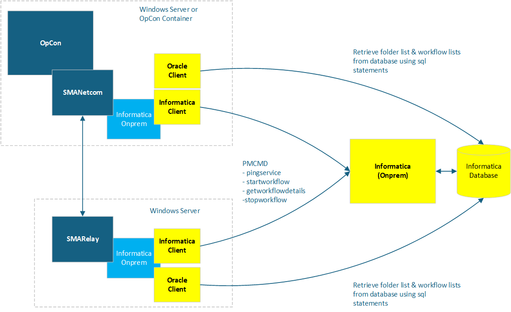

# Informatica On-Prem ACS overview

**Theme:** Overview | **Audience:** Automation Engineer, System Administrator

## What is it?

The current release is version 25.0.0.

Informatica On-prem ACS provides access to Informatica On-prem environment workflows from OpCon. It uses the Informatica client components to communicate with the Informatica environment and is part of the ACS (Agentless Connector System) suite of products.

Use this connector when:

- You need to schedule and monitor Informatica workflows from OpCon alongside other jobs in your automation environment.
- Informatica workflows must run in a defined sequence with other OpCon jobs across systems.
- Your Informatica environment is on-premises and you need centralized job tracking without deploying a separate cloud agent.

The connector is loaded into OpCon at startup as part of the ACS framework. All agent and job definitions are created and managed in Solution Manager.

## How it works

### Deployment

The connector can be installed alongside an OpCon system or within a SmaRelay installation. It communicates with Informatica using two command-line utilities:

- **Pmcmd** — submits and monitors workflow execution
- **Pmrep** — queries repository metadata such as folder and workflow names

### Availability check

Before accepting workflow requests, the connector uses the Pmcmd **pingservice** command to confirm the Informatica environment is available. If the command succeeds, the connection is marked as available in OpCon and workflow submission is enabled.

### Folder and workflow discovery

The connector retrieves folder and workflow information from the Informatica database:

- Folder names are retrieved periodically using SQL statements and cached in a **folders.txt** file.
- When a folder is selected during task definition, available workflows are retrieved from the database and displayed in the workflow list.

### Workflow execution and monitoring

| Action | Command | Description |
|--------|---------|-------------|
| Start | `startworkflow` | Submits the workflow to the Informatica environment |
| Monitor | `getworkflowdetails` | Checks workflow status while it is running |
| Stop | `stopworkflow` | Stops a running workflow (triggered by the OpCon Kill function) |

## Job types

| Job type | Description |
|----------|-------------|
| Run | Run and monitor an Informatica workflow. |

## FAQs

**What happens if the Informatica environment is unavailable?**
The connector uses the Pmcmd `pingservice` command to check availability before accepting workflow requests. If the command fails, the connection is not marked as available in OpCon and workflow submission is suspended until the environment responds successfully.

**Can I stop a running workflow from OpCon?**
Yes. Use the OpCon Kill function on the running job. The connector sends a `stopworkflow` command to the Informatica environment to stop the workflow.

**What is the difference between an on-premises and cloud deployment of the connector?**
For on-premises deployments, the connector is installed in the `\SAM\plugins` folder and runs within the OpCon system. For cloud deployments, it is installed in the `\Relay\plugins` folder and runs within a SmaRelay installation that bridges the on-premises Informatica environment to OpCon Cloud.

## Glossary

**ACS (Agentless Connector System)** — The OpCon framework for building integrations that do not require a standalone agent installation. Integrations are packaged as DLLs loaded by the SMANetCom module.

**Pmcmd** — The Informatica command-line utility used to start, stop, and monitor workflow execution.

**Pmrep** — The Informatica command-line utility used to query repository metadata, such as folder and workflow names.

**SmaRelay** — The relay service used in cloud deployments to bridge on-premises resources with OpCon Cloud.

**Related topics:**

- [Install the Informatica On-Prem ACS connector](./installation.md)
- [Define an Informatica connection and jobs](./InformaticaOperation.md)
